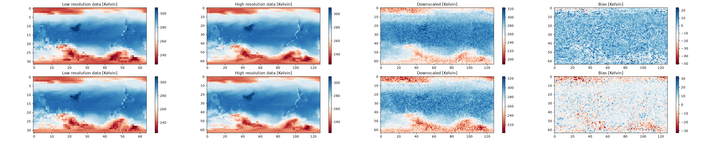
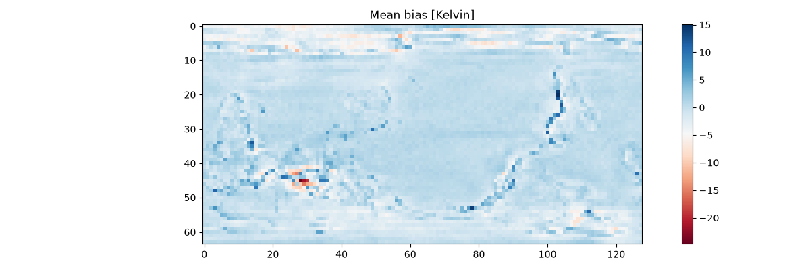

# Climate Downscaling with a ResNet

> A deep-learning pipeline that downscales ERA5 2m temperature from 5.625° to 2.8125° resolution using a ResNet.

---
## Overview

Climate models output temperature and other variables on coarse grids, but regional decisions (agriculture, infrastructure, disaster preparedness) need finer detail. Spatial downscaling learns a mapping from a low-resolution grid to a high-resolution one for the same timestamp, without needing to expensively re-run a climate model at higher resolution.

This project trains a ResNet (bilinear-upsampled, then refined by 28 residual blocks) to map 5.625° ERA5 2m-temperature fields (32×64 grid) to 2.8125° fields (64×128 grid), and evaluates it against the held-out high-resolution ground truth.

**Key outputs:**
- A trained downscaling model with test RMSE 3.64K, Pearson correlation 0.989, mean bias -1.57K
- Side-by-side visualisations of low-res input, high-res ground truth, model output, and bias
- A mean-bias map across the full test set
---

## Background & Motivation

General Circulation Models (GCMs) produce coarse-resolution projections of future climate. Statistical downscaling — learning `high-res = f(low-res)` from historical reanalysis data — is a much cheaper way to get regionally actionable detail than re-running the underlying physical model at higher resolution. This project frames downscaling as an image super-resolution problem and applies CNN architectures to it.

---

## Methodology

### Data sources

| Dataset | Source | Notes |
|---|---|---|
| ERA5 2m temperature, 5.625° | [WeatherBench](https://github.com/pangeo-data/WeatherBench) | low-resolution input, 32×64 grid |
| ERA5 2m temperature, 2.8125° | [WeatherBench](https://github.com/pangeo-data/WeatherBench) | high-resolution target, 64×128 grid |

### Approach

1. **Bilinear interpolation** — the low-res input is first upsampled to the target 64×128 resolution
2. **ResNet backbone** (28 residual blocks, 128 hidden channels) — refines the bilinear upsample into the final prediction
3. **Loss/optimization** — MSE training loss, AdamW (lr 1e-5), linear-warmup-cosine-annealing schedule — all the defaults `climate-learn` wires up automatically when loading the model via `architecture="resnet"` rather than building a bare `model="resnet"` (a bare ResNet has no upsampling step and shape-mismatches against the high-res target — this took some digging into the library source to find)

### Key assumptions & limitations

- **Small year range for feasible local training.** A single MPS (Apple Silicon GPU) forward+backward pass on this model takes ~10-25s/batch. The tutorial's original full range (1979-2018, 6-hourly) would take roughly a day *per epoch* on a laptop, so this run is restricted to train=1979, val=1980, test=1981-1982, with daily (not 6-hourly) subsampling. Results would likely improve with the full historical range and a GPU-equipped machine.
- Single variable (2m temperature) — no multi-variable conditioning.
- No uncertainty quantification on predictions.

---

## Results


*Two test-set samples: low-resolution input, high-resolution ground truth, model output, and bias. The model's output recovers fine-grained structure (coastlines, gradients) that bilinear interpolation alone would not.*


*Mean bias (predicted − ground truth) across the test set, mostly within ±5K with a few localised hotspots.*

Test-set metrics: **RMSE 3.64K**, **Pearson correlation 0.989**, **mean bias -1.57K** — strong correlation with reasonable absolute error given the small training set and short training run (5 epochs).

---

## How to Run

```bash
git clone https://github.com/alexadxms/climate-downscaling-resnet.git
cd climate-downscaling-resnet

python3 -m venv .venv
source .venv/bin/activate
pip install -r requirements.txt
```

The pipeline runs as four independent stages, so an interruption only costs you the current stage:

```bash
python downscaling.py prepare              # download + convert ERA5/WeatherBench data (one-off)
python downscaling.py train                # train, checkpointing after every epoch
python downscaling.py train --resume       # continue from the latest checkpoint
python downscaling.py evaluate             # run test-set metrics on the latest checkpoint
python downscaling.py visualise            # produce outputs/*.png from the latest checkpoint
```

### Requirements

- Python 3.11+
- PyTorch, PyTorch Lightning, xarray, netCDF4, h5netcdf, matplotlib
- [`climate-learn`](https://github.com/aditya-grover/climate-learn) (installed from GitHub, not yet stable on PyPI)
- A GPU is not required — this was trained on a MacBook's Apple Silicon GPU (`accelerator="mps"`) — but a long unattended run is realistic given the per-batch timing above.

---

## What I Learned

The original 2022 tutorial notebook no longer runs as-is: the `climate-learn` package has been substantially restructured since publication (new module layout, renamed functions, a completely different model-loading API). Porting it meant reading the current library's source directly rather than trusting the docs, which were themselves out of date in places — for example, the fact that `architecture="resnet"` (not `model="resnet"`) is what actually wires up the bilinear-upsampling wrapper a downscaling task needs was only findable by reading `loaders.py` in the package source.

The other big lesson was about compute budgeting on a laptop: an early run silently spent 21 hours making zero epoch progress, which turned out to be simple arithmetic (per-batch time × batches/epoch) rather than a bug — once timed properly, scaling the dataset to match the actual hardware made the difference between "never finishes" and a 5-epoch run completing in a few hours. Checkpointing after every epoch (rather than only at the end) also turned out to matter in practice, not just in theory — a couple of training runs did get killed mid-flight.

---

## References

- Bansal, H., Goel, S., Nguyen, T., & Grover, A. (2022). *ClimateLearn: Machine Learning for Predicting Weather and Climate* [Tutorial]. NeurIPS. Climate Change AI. https://doi.org/10.5281/zenodo.11620005
- Rasp, S., Dueben, P.D., Scher, S., Weyn, J.A., Mouatadid, S., Thuerey, N. (2020). *WeatherBench: A benchmark data set for data-driven weather forecasting*. JAMES. https://arxiv.org/abs/2002.00469
- [aditya-grover/climate-learn](https://github.com/aditya-grover/climate-learn) — the current `climate-learn` package source

---

*Alex Adams · [alex.adxms@icloud.com](mailto:alex.adxms@icloud.com) · [LinkedIn](https://www.linkedin.com/in/alex-adxms/)*
